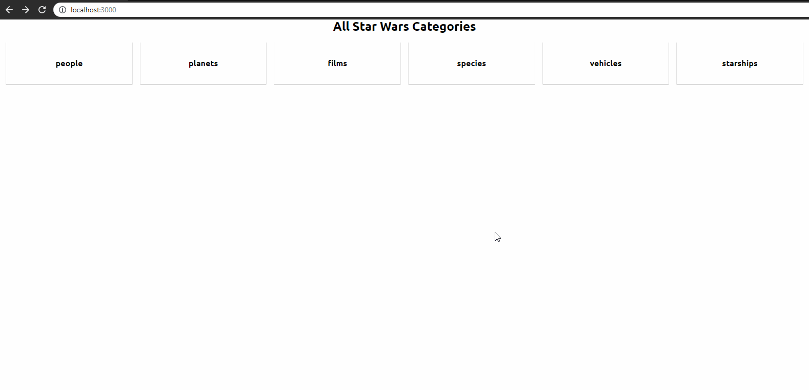

# Label A: Star Wars Assignment

**Link to project:** https://label-a-star-wars.netlify.com/  

**Description:** 
This project serve as learning process to get a better understanding of React.js and at the same time it is assignment from the company: **Label A** to see if my code skills is good enough for the company.

core functionality of the app is to display all Categories of the Star Wars API and when clicked: to show all available items.

This project was created in: ~ 8 hours

## Process

To get a basic understanding of React I've started with watching this [youtube video](https://www.youtube.com/watch?v=sBws8MSXN7A). This video covers: state, props, JSX, events.

Thereafter I've looked up how to create a basic React project and stumble onto the create-react-app cli. `create-react-app` is the command that I've created my project with.

Then I've looked up for the best way to fetch data in React and with the help of this [tutorial](https://www.robinwieruch.de/react-fetching-data/) I've been able to fetch the data.

After a lot of struggling in displaying the data I've used this [tutorial](https://flaviocopes.com/react-how-to-loop/) to create a loop and render the data.

The last step was adding a Router to navigate through the different pages.

## Available Scripts

In the project directory, you can run:

### `npm start`

Runs the app in the development mode. 
Open [http://localhost:3000](http://localhost:3000) to view it in the browser.

The page will reload if you make edits. 
You will also see any lint errors in the console.

### `npm run build`

Builds the app for production to the `build` folder. 
It correctly bundles React in production mode and optimizes the build for the best performance.

The build is minified and the filenames include the hashes. 
Your app is ready to be deployed!

See the section about [deployment](https://facebook.github.io/create-react-app/docs/deployment) for more information.

## Todo
- [ ] add search item
- [ ] add Loading indicator when fetching data

